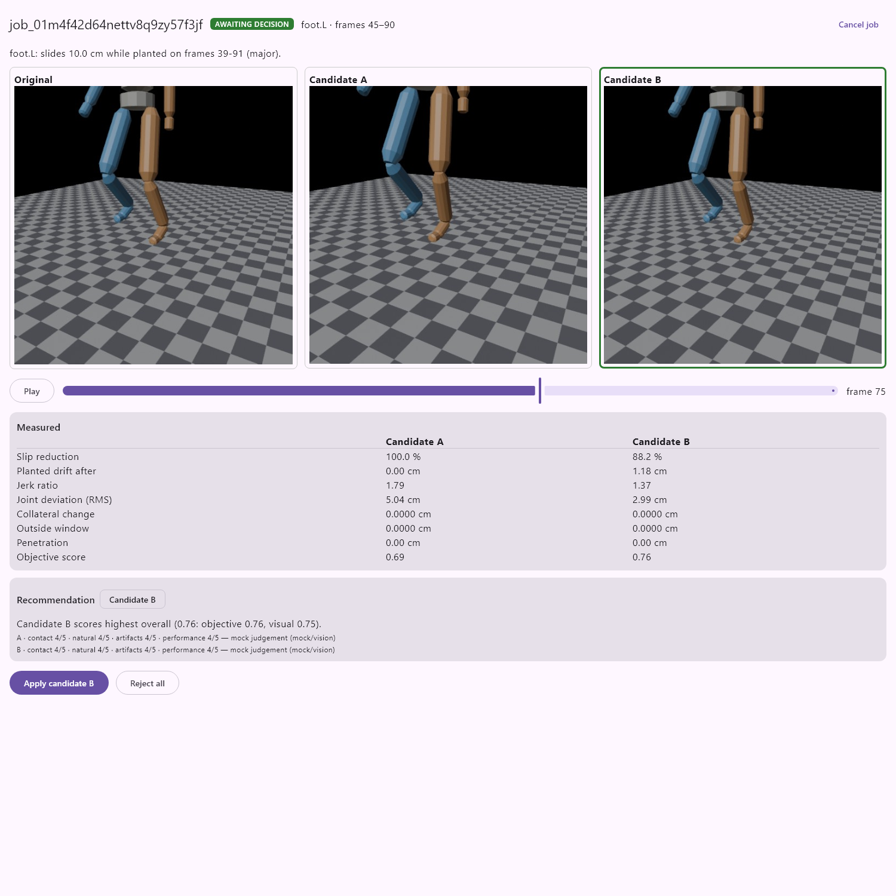

# Kinesis

**Kinesis cuts the time animators spend fixing localized animation defects.**

Here is the workflow. An animator selects a body region, a frame range, and optionally a contact surface or a written instruction. Kinesis then:

- measures the defect;
- builds several non-destructive repair candidates in parallel;
- renders cropped previews of each;
- scores each candidate with deterministic metrics and NVIDIA Nemotron multimodal reasoning;
- presents an A/B comparison.

The animator picks one, and Kinesis applies it as a separate, reversible animation layer.

> AI **plans and evaluates**. Deterministic code **executes**. The human **decides**.

The MVP handles one repair class: **foot-contact / foot-sliding repair in Blender**.

## Status

- **Phase 0: design freeze (complete).** Architecture, contracts, test strategy, CI and spikes. See [docs/PHASE0.md](docs/PHASE0.md).
- **Phase 1: fixture and analysis (complete).** The canonical fixture is built in Blender 4.5, extracted headlessly, and its injected slide is measured at 10.0 cm, both in CI and on the real `.blend`. See [docs/PHASE1.md](docs/PHASE1.md).
- **Phase 2: deterministic repair (complete).** Candidates A and B remove 100% and 88% of the slide with zero collateral change. They are applied as non-destructive NLA layers and rendered as A/B previews. See [docs/PHASE2.md](docs/PHASE2.md).
- **Phase 3: orchestration (complete).** A DAG engine runs the whole repair per job, with retries, circuit breakers, caching and fault isolation, behind a working job API. See [docs/PHASE3.md](docs/PHASE3.md).
- **Phase 4: Nebius / NVIDIA (complete).** Nemotron 3 Super plans the A/B parameters, and a vision model reviews the rendered frames. Both run through Token Factory, behind the same validation gate and fallbacks. Live calls cost about $0.002 per repair. See [docs/PHASE4.md](docs/PHASE4.md).
- **Phase 5: review client (complete).** A Compose Desktop client shows Original, A and B in sync, with the metrics and the model's view, and records the animator's decision. See [docs/PHASE5.md](docs/PHASE5.md).
- **Phase 6: serverless (implemented; live runs pending).** The containerized Blender worker gives the same golden results as host Blender. The Nebius Serverless Jobs runners (one job per step, or one session per repair) are contract-tested against the documented API. Live runs wait on a Nebius account. See [docs/PHASE6.md](docs/PHASE6.md).
- **Evidence:** [docs/BENCHMARKS.md](docs/BENCHMARKS.md) and [docs/SPECS.md](docs/SPECS.md) are generated from real runs. They cover:
  - a 4-scene suite on host Blender and in the container;
  - the vision-model bake-off;
  - model cost per job;
  - the test inventory.

  Reproduce them with `uv run task bench`, `uv run task vlm-bakeoff` and `uv run task specs`. `uv run task demo` runs the scripted end-to-end demo.



## Repository map

| Path | What |
|---|---|
| [docs/](docs/) | Product, architecture, algorithms, API, testing, failure modes, metrics, deployment, ADRs |
| [backend/](backend/) | FastAPI service, Pydantic contracts, orchestration, pure-numpy analysis/repair/evaluation |
| [blender/](blender/) | Thin Blender worker (inspect / extract / apply+render / export), add-on, fixture builder |
| [client/kotlin-desktop/](client/kotlin-desktop/) | Compose Desktop review client |
| [infra/](infra/) | Dockerfiles, Nebius deployment notes |
| [spikes/](spikes/) | Small experiments that check assumptions about Blender and Nebius before we depend on them |
| [tests/](tests/) | unit, contract, fault, golden, integration |
| [scripts/tasks.py](scripts/tasks.py) | Cross-platform task runner (`uv run task <name>`) |

## Quick start

Prerequisites:
- [uv](https://docs.astral.sh/uv/)
- Git
- Optional: Docker Desktop, Blender 4.5 LTS, JDK 17+ (the Gradle toolchain downloads one automatically)

```bash
uv run task setup          # install Python deps, create .env from .env.example
uv run task test           # unit + contract + fault + API tests (no network, no Blender)
uv run task lint           # ruff format check, ruff lint, mypy --strict
uv run task run            # FastAPI on http://127.0.0.1:8000  (docs at /docs)
uv run task setup-blender  # optional: portable Blender 4.5 LTS into .tools/
docker compose up          # optional: API + Redis in containers
```

Run `uv run task --help` to list every task. Normal development and the full test suite never require Nebius credentials.

## License

The code is under the MIT license. The procedurally generated test fixtures are CC0.
