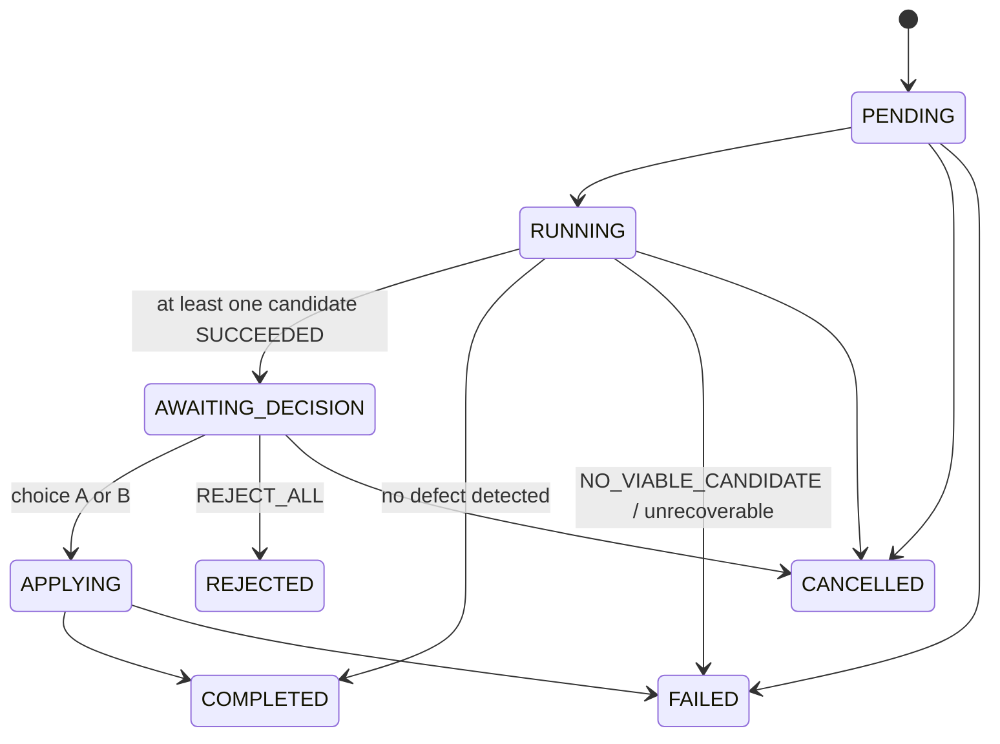

# Kinesis HTTP API (v1)

The machine-readable contract is [`api/openapi.json`](api/openapi.json). It is generated from the FastAPI app by `uv run task openapi`, and CI fails if the committed copy is stale. The Kotlin client generates its models from that file (ADR 0008).

Interactive docs are served at `http://127.0.0.1:8000/docs` while `uv run task run` is active.

## Conventions

- **Versioning:** every path starts with `/v1`. A breaking change means `/v2`. Additive fields are allowed within v1.
- **JSON:** UTF-8. Request bodies reject unknown fields (`extra="forbid"`). Clients must ignore unknown response fields.
- **Units:** world-space meters with Blender's Z-up convention. Metrics carry a `_cm` suffix. Frames are integers in inclusive ranges.
- **IDs:** server-generated, matching `^[a-z0-9][a-z0-9_-]{5,63}$`. `candidate_id` is 16 hex characters and deterministic (see [ALGORITHMS.md §3.4](ALGORITHMS.md#34-candidate-identity)).
- **Errors:** every 4xx and 5xx response is `application/problem+json`. The body is a `Problem` with `{type, title, status, code, detail?, instance?, errors[]}`, and clients switch on `code`, not on the title text.
- **Idempotency:** `POST /v1/jobs` requires the header `Idempotency-Key: [A-Za-z0-9_.:-]{8,128}`.
- **Long-running work:** never done inside a request. Mutating endpoints return `202` along with the job, and progress is observed by polling (ADR 0006).

## Endpoints

### Scenes
| Method | Path | Success | Errors |
|---|---|---|---|
| POST | `/v1/scenes` | 201 `SceneRef` | 413 `FILE_TOO_LARGE`, 422 `FILE_INVALID` |
| GET | `/v1/scenes/{scene_id}` | 200 `SceneRef` | 404 `SCENE_NOT_FOUND` |

The upload request is `multipart/form-data` with one field, `file`. Upload rules:
- The size limit is `KINESIS_MAX_UPLOAD_MB` (default 200).
- The file must start with the bytes `BLENDER`.
- The client filename is ignored.

The server inspects the scene headlessly (armatures, bones, frame range, fps) before responding. Job requests are validated against that inventory.

### Jobs
| Method | Path | Success | Errors |
|---|---|---|---|
| POST | `/v1/jobs` | 202 `RepairJob`; 200 on idempotent replay | 404 `SCENE_NOT_FOUND`, 409 `IDEMPOTENCY_CONFLICT`, 422 `ARMATURE_NOT_FOUND` / `BONE_NOT_FOUND` / `INVALID_FRAME_RANGE` / `UNSUPPORTED_REPAIR_TYPE` / `UNSUPPORTED_RIG` / `VALIDATION_ERROR` |
| GET | `/v1/jobs?limit=50&before=<job_id>` | 200 `RepairJob[]`, newest first | 422 |
| GET | `/v1/jobs/{job_id}` | 200 `RepairJob` | 404 |
| GET | `/v1/jobs/{job_id}/events?after_seq=0&limit=100` | 200 `EventPage` | 404 |
| GET | `/v1/jobs/{job_id}/defect` | 200 `DefectReport` | 404, 409 `NOT_READY` |
| GET | `/v1/jobs/{job_id}/candidates` | 200 `RepairCandidate[]` | 404 |
| GET | `/v1/jobs/{job_id}/candidates/{candidate_id}/metrics` | 200 `CandidateMetrics` | 404, 409 `NOT_READY` |
| GET | `/v1/jobs/{job_id}/evaluation` | 200 `EvaluationReport` | 404, 409 `NOT_READY` |
| POST | `/v1/jobs/{job_id}/decision` | 202 `RepairJob` | 404, 409 `INVALID_STATE`, 422 (chosen candidate FAILED) |
| POST | `/v1/jobs/{job_id}/cancel` | 200 `RepairJob` | 404, 409 `INVALID_STATE` |

**Create.** The request body is `CreateRepairJobRequest`:

```json
{
  "repair_type": "FOOT_CONTACT",
  "plan_mode": "AUTO",
  "selection": {
    "scene_id": "scn_01j9z8k2m4",
    "armature": "Rig",
    "target_bones": ["foot.L"],
    "temporal": {"frame_start": 45, "frame_end": 90, "context_before": 10, "context_after": 10},
    "contact": {"kind": "FLOOR_PLANE", "plane_point": [0, 0, 0], "plane_normal": [0, 0, 1]},
    "instruction": "keep the heel planted, preserve the weight shift"
  }
}
```

**Idempotency semantics.** Kinesis hashes the key together with the canonical JSON of the body.

| Request | Response |
|---|---|
| Same key and same body | `200` with the original job |
| Same key, different body | `409 IDEMPOTENCY_CONFLICT` |

Keys are stored permanently in SQLite with a UNIQUE constraint. Redis acts only as a fast path.

**Job status machine.** This mirrors `JOB_TRANSITIONS` in `kinesis.schemas.common`.



When one candidate fails and the other succeeds, the job still reaches `AWAITING_DECISION`. The failed candidate carries `status: FAILED` and an `error`.

**Events.** The `seq` field increases monotonically per job and starts at 1. To poll:
1. Call `GET /events?after_seq=<last seen>`.
2. Use the returned `next_seq` as the next `after_seq`.
3. Drop any event whose `(job_id, seq)` you have already processed.

While a job is non-terminal, poll every 1 s. After 30 s without new events, back off to 5 s.

**Decision.** The request body is `DecisionRequest`:

```json
{"choice": "B", "note": "A looks locked/robotic", "time_to_decision_s": 41.5}
```

The stored `HumanDecision` records `model_recommended` and the derived `agreed` field. These feed the agreement-rate metric.

### Artifacts
| Method | Path | Success | Errors |
|---|---|---|---|
| GET | `/v1/artifacts/{artifact_id}` | 200 file bytes | 404 `ARTIFACT_NOT_FOUND` |
| GET | `/v1/artifacts/{artifact_id}?frame=<i>` | 200 `image/jpeg`, one frame of a sequence | 404 |

Artifacts are referenced by `ArtifactReference.uri`.
- For `PREVIEW_FRAMES`, frame index `i` maps to scene frame `first_frame + i * frame_step`, for `0 ≤ i < frame_count`.
- The server resolves the ID through its store and enforces that the final path stays inside the jobs root. Client-supplied paths are never accepted.

### Ops
| Method | Path | Success |
|---|---|---|
| GET | `/v1/health` | 200 `HealthReport` (liveness) |
| GET | `/v1/health/providers` | 200 `HealthReport` with components `model_provider`, `redis`, `blender` |
| GET | `/v1/metrics` | 200 Prometheus text |
| GET | `/v1/stats/product` | 200 `ProductStats` (see [METRICS.md](METRICS.md)) |

## Implementation status

Every route is implemented. `GET /v1/jobs` (the job list) was added in Phase 5 for the review client. `tests/unit/test_api_contract.py` pins the contracts, and `tests/integration/test_api_jobs.py` covers their behaviour.

Two details that the tables above leave open:
- **Choosing a FAILED candidate** returns `422 VALIDATION_ERROR`.
- **A scene that fails headless inspection** returns `422 FILE_INVALID` with the worker's reason.
