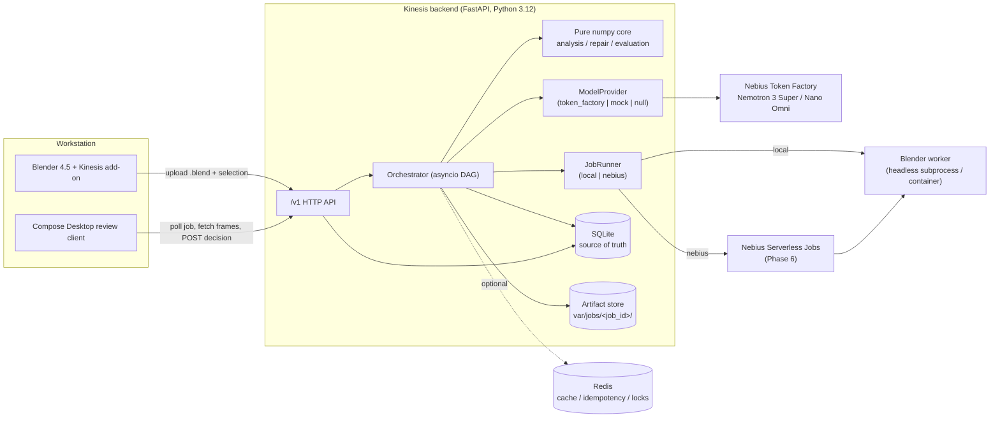
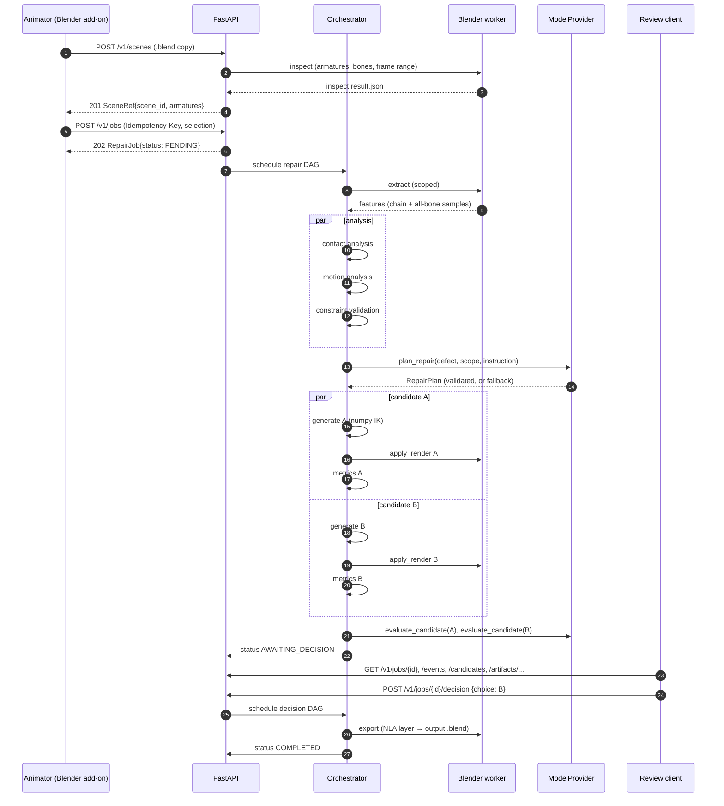
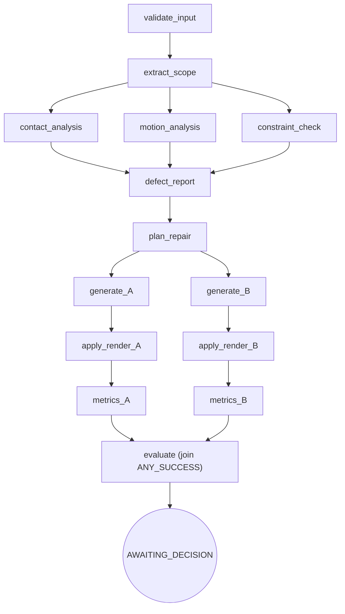

# Kinesis: Architecture

This document freezes the system structure for the MVP. Each decision is recorded as an ADR in [ADR/](ADR/). Exact numeric algorithms live in [ALGORITHMS.md](ALGORITHMS.md), and the HTTP contract lives in [API.md](API.md).

## 1. Component view



### Responsibilities

| Component | Owns | Never does |
|---|---|---|
| **Blender worker** (`blender/worker`) | Inspecting armatures, extracting world/local transforms, writing keyframes into new Actions, building NLA tracks, rendering crop and context frames, exporting `.blend` files | Repair math, detection, AI calls, network I/O |
| **Blender add-on** (`blender/addon`) | Selection UI (rig, bones, frame range, floor), saving a copy and submitting it, importing the chosen repair Action (Phase 5/7) | Running repairs in the UI thread |
| **Pure core** (`kinesis.analysis`, `.repair`, `.evaluation`) | Cropping, contact detection, two-bone IK, candidate generation, all metrics | Importing fastapi, redis, httpx or bpy (enforced by a test) |
| **Orchestrator** (`kinesis.orchestration`) | DAG scheduling, retries, circuit breakers, caching, fault isolation, emitting events | Domain math |
| **Providers** (`kinesis.providers`) | Prompting, structured output, and parsing and validating model responses | Executing anything a model returns |
| **Job runners** (`kinesis.jobs`) | Running worker commands with fixed argv, timeouts and isolated job directories | Accepting free-form shell arguments |
| **API** (`kinesis.api`) | Validation, idempotency, serving state and artifacts | Long-running work in request handlers |
| **Review client** | Displaying state, synchronized playback, capturing the decision | Business logic (it stays a thin client) |

## 2. Request lifecycle



## 3. DAG definition

The repair run is a static DAG instantiated per job. Each node is declared as:

```python
Node(id, deps, fn, retry: RetryPolicy, timeout_s, cache_key: Callable | None, join: ALL | ANY_SUCCESS)
```



| Node | Kind | Inputs | Output | Retry | Timeout | Cache key |
|---|---|---|---|---|---|---|
| `validate_input` | pure | request, scene inventory | `SkeletalScope`, resolved `TemporalScope` | none | 1 s | none |
| `extract_scope` | worker | scene, scope | `AnimationFeatures` artifact + all-bone world samples | 2× on `WorkerCrashed`/timeout | 120 s | `sha256(blend) ‖ selection_hash ‖ worker_version` |
| `contact_analysis` | pure | features | `PlantedInterval[]` | none | 5 s | `features_hash ‖ detection_config_hash` |
| `motion_analysis` | pure | features | velocity/jerk baselines | none | 5 s | same pattern |
| `constraint_check` | pure | features, rig limits | baseline joint-limit report, IK reachability | none | 5 s | same pattern |
| `defect_report` | pure (join ALL) | the three above | `DefectReport` | none | 1 s | none |
| `plan_repair` | provider | defect, scope, instruction | `RepairPlan` (MODEL or FALLBACK) | 2× on retryable provider errors, behind the breaker | 60 s | `defect_hash ‖ instruction ‖ model_id ‖ prompt_version` |
| `generate_X` | pure | features, plan.candidates[X] | per-frame local rotations for thigh/shin/foot | none | 10 s | `candidate_id` |
| `apply_render_X` | worker | scene, generated keys | candidate `.blend`, re-extracted all-bone samples, crop and context frames | 1× on `WorkerCrashed` | 300 s | `candidate_id ‖ render_config_hash` |
| `metrics_X` | pure | original + candidate samples | `CandidateMetrics` | none | 5 s | `candidate_id` |
| `evaluate` | provider + pure (join ANY_SUCCESS) | succeeded candidates, frames, metrics | `EvaluationReport` | per-call 2×; on failure `evaluator_status=DEGRADED` | 120 s | none |

The decision DAG is a single node:
- `apply_selected`: a worker call that writes the chosen candidate as an NLA track into `output/<scene>_kinesis.blend`. Retry 1×, timeout 120 s.

### Engine semantics (clean-room rewrite of Evoco's ideas)

- **Validation:** the graph is validated at construction time. Unknown dependencies and cycles raise `DagDefinitionError`, so a bad graph can never hang forever.
- **Scheduling:** a ready set plus `asyncio.wait(FIRST_COMPLETED)`. Independent nodes run concurrently.
- **Results:** they are passed explicitly as `deps → value` mappings, never as "everything completed so far".
- **Failure propagation:**
  - When a node with `join=ALL` has a failed dependency, it is marked **SKIPPED**, and it is counted as skipped, not failed.
  - A `join=ANY_SUCCESS` node runs if at least one dependency succeeded.
- **Cancellation:** cancelling the run cancels every child task inside a `finally` block.
- **Callbacks:** an exception in an event callback is logged. It never aborts the DAG.
- **Retry:**
  - It is decided by `RetryPolicy(max_attempts, base_s=0.5, cap_s=8.0, retry_on=(...))` with exponential backoff and full jitter.
  - Only *classified-retryable* errors are retried: timeout, HTTP 429, 5xx, `WorkerCrashed`. Validation errors are never retried.
- **Circuit breaker:** one per provider endpoint, with the states CLOSED / OPEN / HALF_OPEN.
  - State transitions happen under the lock, and the HALF_OPEN probe count is tracked explicitly. Evoco relied on a semaphore leak here, and that is avoided.
  - Client errors (4xx other than 429) do not count as breaker failures.
- **Caching:** the async `redis.asyncio` client with one pool.
  - Values are JSON (Pydantic `model_dump_json`) and are **never** pickled.
  - If Redis errors, the cache logs it and falls back to a bounded in-process LRU, and the job continues.
- **Correlation:** a `contextvars.ContextVar` carries `job_id`, `node`, `candidate_id` and `attempt` into every log record.

## 4. Data and persistence

| Store | Contents | Lifetime | Source of truth? |
|---|---|---|---|
| **SQLite** (`var/kinesis.db`) | scenes, jobs (Pydantic JSON column + indexed status), events (`job_id, seq` unique), decisions, idempotency keys (unique) | permanent | **yes** |
| **Artifact store** (`var/jobs/<job_id>/`) | `input/scene.blend` (read-only copy), `work/` (worker specs and results), `candidates/<cid>/` (blend, frames, metrics), `output/` | until the job is deleted or swept by the TTL sweeper | yes, for the files themselves |
| **Redis** (optional) | analysis cache, idempotency fast path, per-job lock, DAG coordination | TTL (default 24 h) | **no**, and it can be flushed at any time |

The data rules:
- `job_id` is a ULID-style sortable string.
- Artifacts are addressed by `artifact_id` and resolved through the DB, never by a client-supplied path.
- Every resolved path is checked with `Path.resolve().is_relative_to(jobs_root)`.

## 5. Blender worker contract

The worker is invoked **only** with a fixed argv:

```
<KINESIS_BLENDER_BIN> --background --factory-startup -noaudio <job_dir>/input/scene.blend
    --python-exit-code 3 --python blender/worker/main.py -- --command <inspect|extract|apply_render|export> --spec <job_dir>/work/<node>.spec.json
```

- **Fixed values:** `command` comes from an enum, and `spec` is a path that the backend created inside the job directory.
- **Input and output:** the worker reads the spec JSON and writes `<node>.result.json` next to it, and the backend validates that result with Pydantic (`kinesis.schemas.worker`).
- **Exit codes:** a non-zero exit, a missing result or an invalid result raises `WorkerCrashed` or `WorkerOutputInvalid`.
- **No Python packages:** the worker uses only `bpy`, `mathutils` and Blender's bundled numpy, so nothing is pip-installed into Blender.

Details are in [blender/worker/io_contract.md](../blender/worker/io_contract.md).

### Non-destructive layering

The approach depends on spike S1 confirming that it works on 4.5. Kinesis makes these guarantees:

- The input `.blend` is copied into the job directory and never written.
- The original Action is never edited.
- Each candidate is a **new Action** (`KIN_<job>_<label>`) holding keys only for the chain bones (thigh, shin, foot), and only on frames inside the repair window plus the blend frames.
- The worker attaches it as an NLA strip on a new track `Kinesis/<label>`, with blend type Replace and influence 1, above the original action. Every bone without a channel in that Action evaluates from the original.
- `export` writes `output/<scene>_kinesis.blend` with the selected track enabled and the others removed. Muting the track restores the original animation exactly.

## 6. Model provider

```python
class ModelProvider(Protocol):
    async def plan_repair(self, req: PlanRequest) -> ProviderResult[RepairPlan]: ...
    async def evaluate_candidate(
        self, req: EvaluationRequest
    ) -> ProviderResult[VisualEvaluation]: ...
    async def analyze_visual(
        self, req: VisualAnalysisRequest
    ) -> ProviderResult[VisualFindings]: ...
    async def health_check(self) -> ProviderHealth: ...
```

| Task | Config key | Intended model (verified by spike S4) |
|---|---|---|
| Repair planning, constraint reasoning | `KINESIS_PLANNER_MODEL` | Nemotron 3 Super |
| Rendered-frame evaluation | `KINESIS_VISION_MODEL` | Nemotron 3 Nano Omni |
| Cheap classification (e.g. instruction intent) | `KINESIS_CLASSIFIER_MODEL` | Nemotron Nano |

Routing rules:
- No model ID is hard-coded outside configuration.
- `uv run task models` lists the models available to the configured key.
- Ultra is not used unless an experiment shows it is worth the cost and latency.

**Plan validation pipeline.** Every model response goes through these steps:

1. Parse the JSON.
2. Validate against `RepairPlan` with `extra="forbid"` and bounded fields.
3. Run `validate_plan_against_scope()`. It requires that:
   - the bones are a subset of the skeletal scope;
   - the frames fall inside the temporal context;
   - the `repair_type` is supported;
   - the A and B parameters are within bounds.
4. If any step fails, the result is `ProviderResult.invalid(reason)`. The orchestrator then uses `default_plan()` (`plan_source=FALLBACK`) and logs the rejection.

An invalid plan never reaches a worker.

## 7. Observability

- **Logging:** stdlib `logging` with a JSON formatter.
  - Every record carries `job_id`, `node`, `candidate_id`, `attempt`, `elapsed_ms`, and, where relevant, `model`, `prompt_tokens`, `completion_tokens`, `cost_estimate_usd`, `frame_range`, `target_bones` and `render_ms`.
- **Prometheus** (`GET /v1/metrics`):
  - `kinesis_job_duration_seconds`
  - `kinesis_node_duration_seconds{node}`
  - `kinesis_provider_calls_total{model,outcome}`
  - `kinesis_provider_tokens_total{model,kind}`
  - `kinesis_worker_duration_seconds{command}`
  - `kinesis_cache_requests_total{result}`
  - `kinesis_retries_total{node}`
  - `kinesis_candidates_total{status}`
- **Product statistics** (`GET /v1/stats/product`) are computed from SQLite. See [METRICS.md](METRICS.md).

## 8. Security

- Secrets come only from the environment. `.env` is git-ignored and `.env.example` documents the keys.
- No LLM output is ever executed. Plans are data, validated against a closed schema.
- Uploaded files:
  - must be at most `KINESIS_MAX_UPLOAD_MB` and start with the `BLENDER` magic header;
  - are stored as `input/scene.blend`, with the client filename ignored;
  - are loaded with `--factory-startup`. Auto-run Python scripts are disabled by default in background mode, and the worker asserts this.
- The worker runs with a fixed argv, no shell, a timeout and a single job directory. Containerized workers get a read-only image plus one writable job-dir mount.
- There is no `pickle`, `yaml.load` or `eval` anywhere. Persistence and the worker protocol use JSON only.
- A TTL sweeper deletes job directories, defaulting to 7 days.

## 9. Repository layout

```
Kinesis/
  backend/src/kinesis/   api/ schemas/ providers/ orchestration/ jobs/ analysis/ repair/ evaluation/ storage/ observability/ testing/
  blender/               addon/ worker/ fixtures/
  client/kotlin-desktop/
  docs/                  ADR/ api/openapi.json
  infra/                 docker/ nebius/
  spikes/
  tests/                 unit/ contract/ fault/ golden/ integration/ fixtures/
  scripts/               tasks.py export_openapi.py
```

There is one deviation from the original proposal. The numpy math lives in `backend/src/kinesis/{analysis,repair,evaluation}` as Blender-free modules, so detection, IK and metrics can be unit- and golden-tested in normal CI. Blender is reduced to a thin I/O and render worker. See [ADR 0003](ADR/0003-numpy-core-thin-blender-worker.md).

## 10. Dependencies

Each dependency must earn its place. Boring and well-maintained beats fashionable.

### Python runtime (`backend/pyproject.toml`)

| Package | Why |
|---|---|
| `fastapi` | HTTP API and automatic OpenAPI. The OpenAPI document is the client contract |
| `uvicorn` | ASGI server |
| `pydantic` (v2) | All contracts, strict validation of AI output |
| `pydantic-settings` | Typed env configuration |
| `python-multipart` | Required by FastAPI for `.blend` uploads |
| `httpx` | Token Factory and Nebius REST, async, with `MockTransport` for tests and no extra mock library |
| `redis` | `redis.asyncio` client for the optional cache, idempotency and locks |
| `numpy` | All motion math. It is also bundled with Blender, so the same idioms work in the worker |
| `prometheus-client` | Operational metrics endpoint |

### Python dev

| Package | Why |
|---|---|
| `pytest`, `pytest-asyncio` | Test runner and async tests |
| `hypothesis` | Property and invariant tests (preservation, determinism, idempotency) |
| `ruff` | Formatter and linter in one fast tool |
| `mypy` | Strict type checking of `kinesis` |
| `fakeredis` | Redis semantics in unit and fault tests without a server |
| `httpx2` | Transport for Starlette's `TestClient`, which has deprecated `httpx` for it. Dev only. Runtime code keeps `httpx` (ADR 0009) |

### Deliberately excluded

| Excluded | Reason |
|---|---|
| SQLAlchemy / ORM | A handful of tables. Stdlib `sqlite3` behind a `JobStore` protocol is enough, and Postgres can come later behind the same protocol |
| Celery / RQ | The asyncio DAG plus `JobRunner` covers the workload, so an extra broker adds no value |
| `openai` SDK | A small endpoint surface. `httpx` keeps the usage and error fields explicit and mockable |
| structlog | Stdlib logging with a JSON formatter covers the requirement |
| scipy | Smoothing and IK are a few lines of numpy |

### Kotlin client

| Library | Why |
|---|---|
| Compose Multiplatform (desktop) | The desktop UI the target user needs |
| Ktor client (CIO) + content negotiation | HTTP polling and artifact download |
| kotlinx-serialization | JSON. The generated models use it |
| kotlinx-coroutines (+ test) | Polling loops, a state flow, deterministic tests |
| openapi-generator (Gradle plugin, models only) | Generates the DTOs from `docs/api/openapi.json`, so no field definitions are hand-copied |
| kotlin-test, ktor-client-mock | Unit tests of serialization, state and polling recovery |
| foojay toolchain resolver | Auto-provisions JDK 17 when the machine only has an older JDK |
